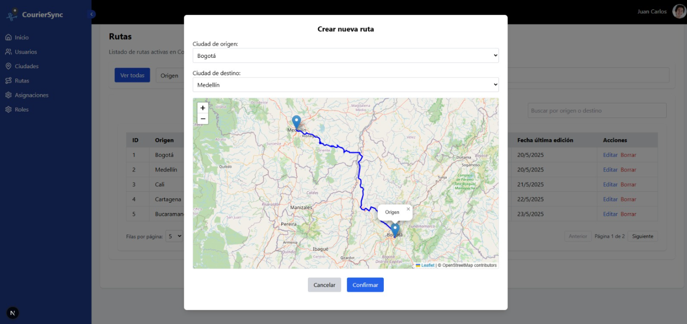

# CourierSync

[](https://github.com/Claudia-Rocha-H/Couriersync-front/commits/main)
[](https://github.com/Claudia-Rocha-H/Couriersync-front/issues)

## Project Overview

CourierSync is a comprehensive web-based logistics management platform designed to optimize the administration of routes, vehicles, and drivers within a courier company. It features role-based dashboards (Administrator, Operator, and Driver) with secure access, an intuitive interface, and full CRUD (Create, Read, Update, Delete) functionalities across all modules.

## Key Features

* **Comprehensive Management:** Facilitates the management of users, vehicles, routes, cities, and assignments.
* **Full CRUD Operations:** Complete CRUD capabilities for each management module.
* **Role-Based Interfaces:**
    * **Admin:** Full system management access.
    * **Operator:** Oversight of assignments and routes, including reporting.
    * **Driver:** Personal assignment viewing and route details.
* **Secure Authentication:** Protected by session-based authentication and robust role validation.
* **Security Measures:** Includes early detection mechanisms for SQL injection attempts and other malicious activity.

## Technologies Used

* **Frontend:**
    * **Next.js 15**
    * **TypeScript**
    * **TailwindCSS**
    * **React Hook Form** with **Zod** for form validation.
    * **Deployment:** Vercel
* **Backend:** 
    * **Spring Boot**
    * **PostgreSQL** (Database modeling and deployment on Railway)
* **Design:** Figma (Atomic Design)

## Project Structure (Frontend)

```bash
src/
├── components/          # Reusable UI components
├── features/            # Module-specific logic (auth, users, routes, etc.)
├── app/                 # Next.js routes and pages
├── hooks/               # Custom React hooks
├── lib/                 # Utility functions
└── styles/              # Global style configurations
```
## Role-Based Access & Functionalities

| Role       | Access                                                                     |
| :--------- | :------------------------------------------------------------------------- |
| **Admin** | Full panel access, management of users, routes, vehicles, cities, assignments. |
| **Operator** | Routes, assignments, and reports.                                          |
| **Driver** | Personal assignments and route details.                                    |


## Preview
Deployment: https://couriersync.vercel.app/login

See a demonstration of the application's navigation and role-based interactions below:


### Map Integration

The application also integrates with mapping services to visualize routes. Here's an example of a loaded map:



## Security

* Utilizes `ProtectedRoute` for session and role-based validation.
* Implements detection of malicious parameters (e.g., XSS, SQLi) from navigation inputs.
* Custom error response (error 998) for detected malicious attempts.

## Authorship

Developed by Claudia Rocha H.
